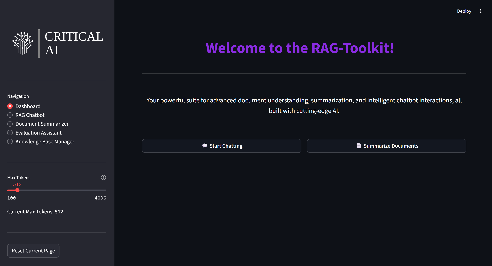

# 🧠 RAG-Toolkit

A modular, GPU-accelerated Retrieval-Augmented Generation system built for [Critical AI](https://criticalai.in/). This toolkit integrates a FastAPI backend and a Streamlit frontend, with support for `llama-cpp-python` and custom embeddings.

---

## 📦 Repository

Clone the deployment-ready project:
```
git clone https://github.com/Eros483/rag-runner-deployment
cd rag-runner-deployment
```
---
## ⚙️ Environment Setup
1. We recommend using Anaconda for environment management.

2. Create the environment using the provided environment.yml, and activate it:
```
conda env create -f environment.yml
conda activate ragEnv
npm install -g tileserver-gl-light
```
3. Ensure the following are installed:

    - Node.js
    - Microsoft C++ Build Tools (via Visual Studio Build Tools)
    - NVIDIA CUDA Toolkit (matching your GPU driver and CUDA version)

4. Install llama-cpp-python with CUDA compatibility, by following the below instructions:
```
call "C:\Program Files\Microsoft Visual Studio\2022\Community\VC\Auxiliary\Build\vcvars64.bat"
where cl
where cmake
set CMAKE_ARGS=-DGGML_CUDA=ON
set FORCE_CMAKE=1
pip install llama-cpp-python --no-cache-dir --verbose
```
#### Note: Installation of llama-cpp-python can take well over an hour.
---

## 🚀 Running the App
```
python run_app.py
```
---
## Project Structure
```
D:.
|   .env
|   .gitignore
|   environment.yml
|   README.md
|   requirements.txt
|   run_app.py
|   test.ipynb
|   todo.txt
|
+---backend
|   |   main.py
|   |   setup.py
|   |
|   +---core
|   |   |   config.py
|   |   |   models.py
|   |
|   +---database
|   |   |   mongodb_client.py
|   |
|   +---metrics
|   |
|   +---models
|   |   |   Llama-3.2-8B-Instruct-Q5_K_M.gguf
|   |   |   llm_model.py
|   |
|   +---mongodb_sample_images
|   |
|   +---persistent_data
|   |       permanent_rag_index.faiss
|   |       permanent_rag_index.json
|   |
|   +---routers
|   |   |   evaluator_router.py
|   |   |   image_router.py
|   |   |   persistent_rag_router.py
|   |   |   rag_router.py
|   |   |   summarizer_router.py
|   |
|   +---sample_documents
|   |
|   +---services
|   |   |   evaluator_service.py
|   |   |   image_indexing_service.py
|   |   |   persistent_index.py
|   |   |   rag_service.py
|   |   |   summarizer_service.py

+---frontend
|   |   app.py
|   |
|   +---company_logo
|   |       logo.png
|   |
|   \---map_cache
|           mumbai_basic.pkl
```
---
## 🛠️ Features

